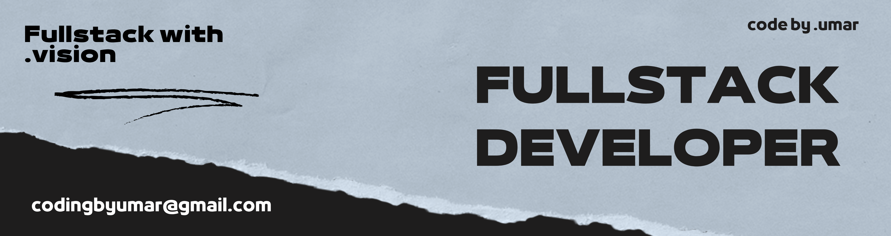

  

> <samp><b>💻 Frontend Developer</b> | 1 years of experience</samp>  
> <samp><b>🛠️ Currently learning</b> | <kbd>Backend Development</kbd></samp>  
> <samp><b>📂 Passionate about</b> | coding, building projects, and learning new tech</samp>

### 🛠️ Tech Stack

<code></code>&nbsp;
<code></code>&nbsp;
<code></code>&nbsp;
<code></code>&nbsp;
<code></code>&nbsp;
<code></code>&nbsp;
<code></code>&nbsp;
<code></code>&nbsp;
<code></code>&nbsp;
<code></code>&nbsp;
<code></code>&nbsp;
<code></code>&nbsp;
<code></code>&nbsp;
<code></code>&nbsp;
<code></code>&nbsp;
<code></code>

  
  
  

